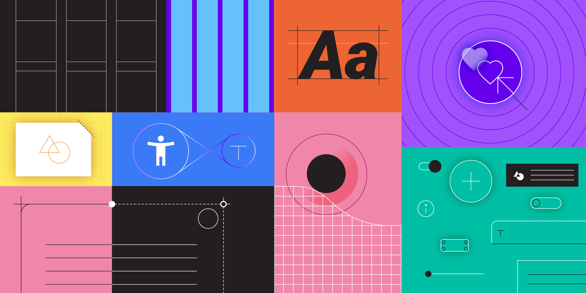
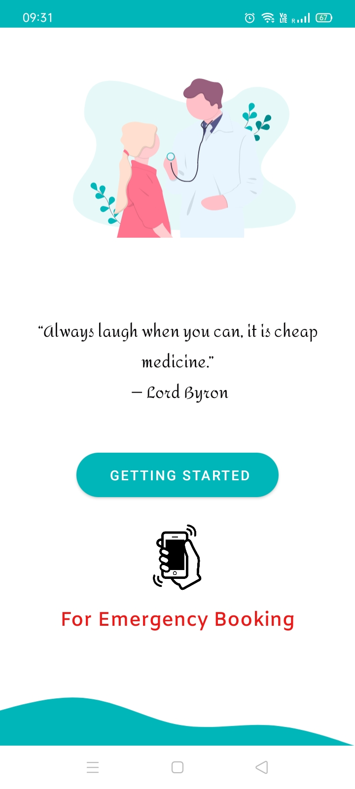
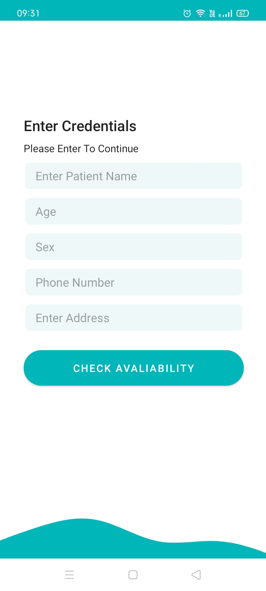
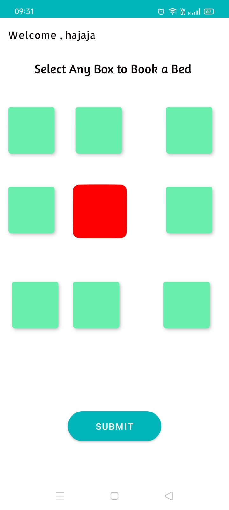
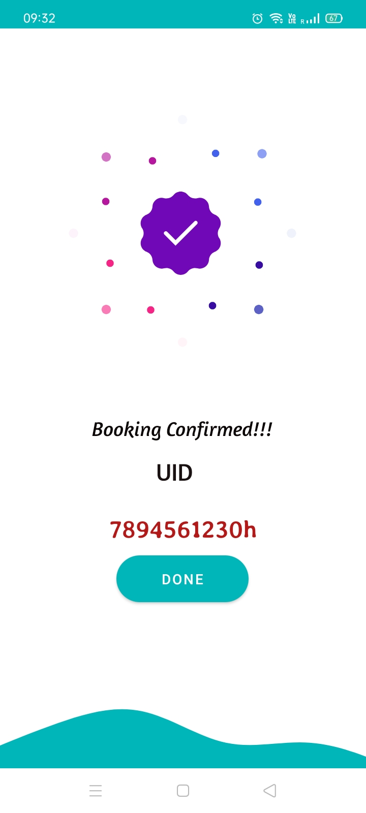

# BedBookingApp
A Hospital Bed Booking App.

## Project Video Link
# [Youtube](https://youtu.be/-FdshgMwsDg)

## Link To Website's Github Repo.
# [WebRepo](https://github.com/arnikchak/hospital_management)

# App Related Info:-

# Technologies Used:-

## Backend:-

Cloud FireStore as a Real time DataBase.

## Frontend:-

# [Lottie](https://lottiefiles.com/) 
 
 
 

# [Material Design](https://material.io/design)

# App ScreenShots

# Project Built As a Part Of doubleSlash Hackathon

